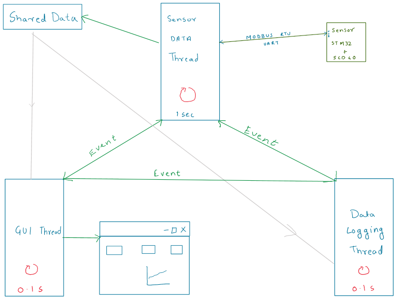

# Thermal Comfort Dashboard

This utility is designed as a part of python course project.

> The objective of this utility is to have a tool that would estimate thermal comfort a person based upon ASHRAE 55 standard.

The utility collects live temperature, humidity and CO2 data from a sensor connected to the system via USB.
In this case the sensor is a custom device based on STM32 microcontroller and sensirion SCD40 sensor.

The communication protocol used over UART is modbus.
Register address 0 to 5 are used as data from device address 0(STM32).

***Note:***
STM32 nucleo series of boards have UART access of MCU to connected debugger. This feature makes it possible to power the device and get data without much complexity

***Assumptions:***
1. sensation is figured out using PMV_PPD method. Mean Radiant Temperature is assumed to be 25 C.
2. Readings are assumed to be accurate. But device may need to be calibrated externally.

### Installation Steps

> pip install pymodbus

> pip install pymodbus[serial]

> pip install pythermalcomfort

***Note:*** pythermalcomfort package needs ***python version 3.9 to 3.12***

> pip install matplotlib

### How to run

> python main.py

### User Interface

### Connection of Hardware

### Verify hardware is detected

### Working of Code

This code is a mix of event based approach and multithreaded approach.

UI elements like buttons only do quick actions that need immediate addressing.

Slow or periodic events are done in background running Python Threads.

Threads are as follows:
1. Sensor Data collection thread - timeperiod of 1 sec
2. Data Logging Thread - timeperiod of 0.1 sec
3. GUI Thread with periodic wakeup - timeperiod of 0.1 sec

The timeperiod of above threads are decided based upon responsiveness required.
Synchronization of thread is done using Python Event Class.
Sensor Data collection thread triggers event for each thread once data is received.
Similarly. GUI Thread can set an event when GUI has exit to turn off Sensor Data Collection or Data Logging.

However, there could be an approach with Python Queue class if large volume of data is expected.

